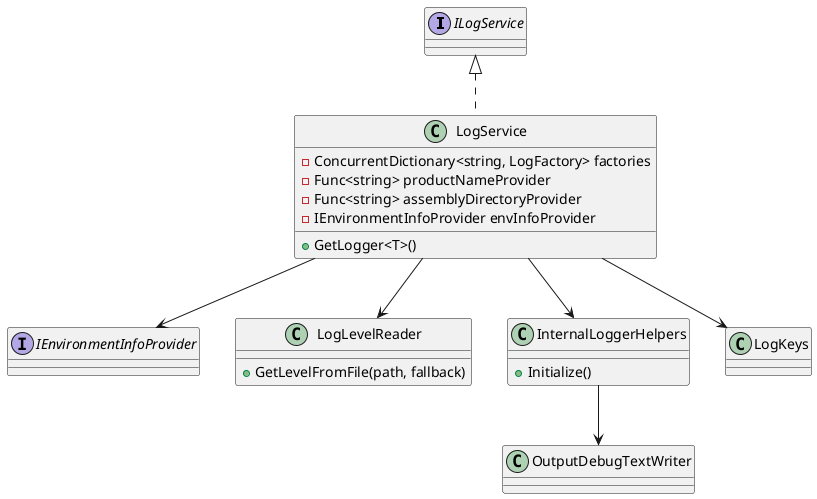

* * *

📌 LogFactory per Product — зачем и как работает
------------------------------------------------

### ❓ Зачем вообще фабрики

В хосте (например CAD) одновременно могут работать **несколько аддонов / продуктов**:

*   разные сборки
*   разные каталоги
*   разные требования к логированию
*   потенциально разные `nlog.config`

Если использовать один глобальный `LogManager`:

*   конфиги начинают конфликтовать
*   невозможно изолировать логи
*   сложно диагностировать проблемы конкретного аддона

👉 Поэтому используется **отдельная `LogFactory` на каждый продукт (`productName`)**

* * *

🧠 Идея архитектуры
-------------------

```
productName → LogFactory → Logger
```

Каждый продукт получает:

*   свою конфигурацию логирования
*   свой каталог логов
*   свою область изоляции

* * *

⚙️ Как это реализовано
----------------------

### 1\. Кэш фабрик

```
ConcurrentDictionary<string, LogFactory> _factories
```

*   ключ = `productName`
*   значение = `LogFactory`

* * *

### 2\. Получение логгера

```
LogFactory factory = _factories.GetOrAdd(productName, CreateFactory);
Logger logger = factory.GetLogger(type.FullName);
```

👉 Если фабрика уже есть — используется существующая  
👉 Если нет — создаётся через `CreateFactory`

* * *

### 3\. Создание фабрики

```
private LogFactory CreateFactory(string productName)
```

Алгоритм:

#### 3.1 Попытка загрузить внешний конфиг

```
new LogFactory()
```

*   если `nlog.config` найден → используется он
*   если ошибка → fallback

* * *

#### 3.2 Fallback-конфигурация

Если конфиг отсутствует или битый:

```
factory.Configuration = CreateConfiguration(...)
```

Создаётся программная конфигурация:

*   FileTarget (XML лог)
*   Async wrapper
*   ротация файлов
*   уровень логирования из файла-флага

* * *

#### 3.3 Применение переменных (если конфиг внешний)

```
ApplyCommonVariables(...)
```

Передаём в конфиг:

*   `LogsDir`
*   `AppTitle`
*   (опционально) уровень логирования

* * *

#### 3.4 Bootstrap-диагностика

```
WriteFactoryDiagnostics(...)
```

В лог пишется:

*   источник конфигурации (external / fallback)
*   effective уровень логирования
*   уровень InternalLogger
*   информация о среде (CAD / OS)
*   ошибки загрузки конфига

* * *

🔒 Почему используется `ConcurrentDictionary`
---------------------------------------------

```
GetOrAdd(productName, CreateFactory)
```

Гарантирует:

*   потокобезопасное создание фабрик
*   отсутствие дублирования
*   ленивую инициализацию

⚠️ Важно:  
`CreateFactory` может быть вызван несколько раз конкурентно,  
но в словарь попадёт только один результат.

* * *

🧩 Изоляция логирования
-----------------------

Каждая фабрика:

*   не влияет на другие
*   может иметь свой `nlog.config`
*   пишет в свой каталог:

```
%AppData%\<ProductName>\logs\
```

* * *

🧪 Диагностика
--------------

При создании фабрики в лог пишется:

```
LogFactory initialized MyAddon;
ConfigSource: Fallback;
EffectiveMinLevel: Debug;
InternalLoggerLevel: Info
```

Это позволяет сразу понять:

*   откуда взялась конфигурация
*   какой уровень реально применяется
*   были ли ошибки

* * *

✅ Итог
------

Использование `LogFactory` на продукт даёт:

*   изоляцию логирования между аддонами
*   предсказуемую конфигурацию
*   безопасную работу в многомодульном хосте
*   удобную диагностику

* * *

* * *

📦 drz.LogBootstrap
===================

Библиотека для централизованной настройки логирования на базе **NLog** с дополнительными утилитами для диагностики, управления уровнями логов и получения информации об окружении.

Основная цель — упростить и стандартизировать конфигурацию логирования в приложениях.

* * *

🔧 Возможности
==============

*   Централизованная настройка NLog
*   Поддержка нескольких `LogFactory` (по ключам)
*   Гибкое управление уровнями логирования через файл
*   Встроенная диагностика NLog (internal logger)
*   Вывод логов:
    *   в файл
    *   в Output (Visual Studio)
    *   в консоль
*   Расширяемость через интерфейсы

* * *

🧱 Архитектура
==============

Проект состоит из следующих основных частей:

```
drz.LogBootstrap
├── LogService.cs
├── Diagnostics/
│   ├── InternalLoggerHelpers.cs
│   ├── LogKeys.cs
│   ├── LogLevelReader.cs
│   └── OutputDebugTextWriter.cs
└── Interfaces/
    ├── IEnvironmentInfoProvider.cs
    └── ILogService.cs
```

* * *

📄 Подробное описание классов
=============================

* * *

🔹 LogService
-------------

**Namespace:** `drz.LogServices`  
**Роль:** Центральный сервис логирования (основная точка входа)

### 📌 Назначение

*   Управляет созданием и хранением `LogFactory`
*   Предоставляет логгеры (`Logger`)
*   Инкапсулирует конфигурацию NLog
*   Обеспечивает переиспользование фабрик логов

### ⚙️ Основные поля

```
private static readonly ConcurrentDictionary<string, LogFactory> _factories;
```

*   Хранит набор фабрик логов
*   Ключ — строка (например, имя приложения/модуля)
*   Позволяет изолировать конфигурации

```
private readonly Func<string> _productNameProvider;
private readonly Func<string> _assemblyDirectoryProvider;
private readonly IEnvironmentInfoProvider _envInfoProvider;
```

*   Провайдеры данных (ленивая инициализация)
*   Позволяют внедрять зависимости без жесткой привязки

### 🧠 Логика работы

1.  При запросе логгера:
    *   Проверяется наличие `LogFactory` в `_factories`
    *   Если нет — создается новая конфигурация
2.  Конфигурируется NLog:
    *   таргеты (файлы, консоль и т.д.)
    *   уровни логирования
    *   layout
3.  Возвращается `Logger`

### 📌 Особенности

*   Потокобезопасность (`ConcurrentDictionary`)
*   Lazy-инициализация фабрик
*   Возможность кастомизации окружения

* * *

🔹 ILogService
--------------

**Namespace:** `drz.LogServices.Interfaces`  
**Роль:** Контракт для сервиса логирования

### 📌 Методы

```
Logger GetLogger<T>();
Logger GetLogger(Type type);
```

### 🧠 Назначение

*   Абстрагирует использование логгера
*   Позволяет легко подменять реализацию
*   Упрощает тестирование

* * *

🔹 IEnvironmentInfoProvider
---------------------------

**Namespace:** `drz.LogServices.Interfaces`  
**Роль:** Провайдер информации об окружении

### 📌 Метод

```
string GetSummary();
```

### 🧠 Назначение

*   Возвращает информацию об окружении:
    *   версия приложения
    *   ОС
    *   конфигурация
*   Используется в логах (например, при старте)

* * *

📁 Diagnostics
==============

Набор вспомогательных классов для диагностики и управления логированием.

* * *

🔹 InternalLoggerHelpers
------------------------

**Роль:** Настройка internal-логирования NLog

### 📌 Что делает

Настраивает **внутренний логгер NLog**, который используется для диагностики самого NLog.

### 📤 Куда пишет

*   🪟 Output Window (Visual Studio)
*   📄 Файл (`*.log`)
*   🖥 Консоль

### ⚙️ Особенности

```
private static bool _initialized;
private static readonly object _lock;
```

*   Гарантирует однократную инициализацию
*   Потокобезопасность

### 📏 Ограничения

```
MaxFileSizeBytes = 10 MB
MaxArchiveFiles = 5
```

*   Ограничение размера логов
*   Ротация файлов

* * *

🔹 LogLevelReader
-----------------

**Роль:** Чтение уровня логирования из файла

### 📌 Метод

```
LogLevel GetLevelFromFile(string path, string fallbackLevelName = "Trace")
```

### 🧠 Логика

1.  Если файл не существует → используется default уровень
2.  Если файл пустой → fallback уровень
3.  Если значение некорректное → fallback уровень
4.  Иначе → парсится `LogLevel`

### 📌 Зачем это нужно

Позволяет менять уровень логирования **без перекомпиляции приложения**

* * *

🔹 LogKeys (LogVar)
-------------------

**Роль:** Константы для переменных логирования

### 📌 Содержит

*   Названия переменных для:
    *   GDC (Global Diagnostics Context)
    *   конфигурации логов

### 📌 Примеры

```
AppTitle
LogsDir
LevelMay
FinalLevel
```

### 🧠 Назначение

*   Убирает "магические строки"
*   Централизует ключи конфигурации

* * *

🔹 OutputDebugTextWriter
------------------------

**Роль:** Кастомный `TextWriter` для вывода в Debug

### 📌 Назначение

Позволяет перенаправить вывод NLog в:

```
Visual Studio → Output Window
```

### ⚙️ Особенности

```
public override Encoding Encoding => Encoding.UTF8;
```

*   Поддержка UTF-8

### 🧠 Как работает

*   Переопределяет `WriteLine`
*   Использует `System.Diagnostics.Debug`
*   Полезно только в Debug-сборке

* * *

🔗 Взаимодействие компонентов
=============================

```
LogService
 ├── использует → IEnvironmentInfoProvider
 ├── использует → LogLevelReader
 ├── использует → LogKeys
 ├── использует → InternalLoggerHelpers
 └── возвращает → Logger (NLog)
```

* * *

🚀 Пример использования
=======================

```
ILogService logService = new LogService(...);

var logger = logService.GetLogger<Program>();

logger.Info("Application started");
logger.Error("Something went wrong");
```

* * *

⚠️ Особенности и рекомендации
=============================

*   Использовать `LogService` как singleton
*   Выносить уровни логирования в файл
*   Включать `InternalLoggerHelpers` только при необходимости (debug)
*   Реализовать `IEnvironmentInfoProvider` под конкретное приложение

* * *

📌 Зависимости
==============

*   `NLog`
*   `drzNLog` (кастомный пакет)

* * *

📎 Итог
=======

Библиотека предоставляет:

*   гибкую архитектуру логирования
*   расширяемость
*   удобную диагностику
*   централизованное управление


* * *

1️⃣ Краткая версия README
=========================


# drz.LogBootstrap

Библиотека для централизованной настройки логирования на базе NLog.

## Возможности

- Централизованная конфигурация логирования
- Поддержка нескольких LogFactory
- Управление уровнями логов через файл
- Диагностика NLog (internal logger)
- Вывод в файл, консоль и Debug Output

## Основные компоненты

- **LogService** — основной сервис логирования
- **ILogService** — интерфейс сервиса
- **IEnvironmentInfoProvider** — информация об окружении
- **LogLevelReader** — чтение уровня логов из файла
- **InternalLoggerHelpers** — диагностика NLog
- **OutputDebugTextWriter** — вывод в Debug
- **LogKeys** — константы

## Пример

```csharp
var logService = new LogService(...);
var logger = logService.GetLogger<Program>();

logger.Info("Started");
````

Назначение
----------

Упрощает настройку и поддержку логирования в приложениях.


---

# 2️⃣ Диаграмма (PlantUML)




* * *

3️⃣ Enterprise-версия README
============================

* * *

📦 Overview
-----------

**drz.LogBootstrap** — инфраструктурная библиотека для стандартизации логирования в .NET-приложениях с использованием NLog.

Решает задачи:

*   унификации конфигурации логов
*   централизованного управления уровнями
*   упрощения диагностики

* * *

🧭 Architecture
---------------

Система построена вокруг `LogService`, который выступает фасадом над NLog.

### Ключевые принципы:

*   **Single entry point** — весь доступ через LogService
*   **Dependency abstraction** — через интерфейсы
*   **Lazy initialization** — фабрики создаются по требованию
*   **Thread safety** — безопасная работа в многопоточности

* * *

🧱 Components
-------------

### LogService

Центральный компонент системы.

**Responsibilities:**

*   управление жизненным циклом `LogFactory`
*   конфигурация NLog
*   предоставление `Logger`

**Особенности:**

*   кеширование фабрик
*   изоляция конфигураций по ключам
*   поддержка DI

* * *

### ILogService

Контракт для логирования.

Позволяет:

*   мокать логирование в тестах
*   заменять реализацию

* * *

### IEnvironmentInfoProvider

Отвечает за сбор информации об окружении.

Используется для:

*   стартовых логов
*   диагностики

* * *

### LogLevelReader

Динамическое управление уровнем логирования.

**Преимущества:**

*   изменение уровня без перезапуска
*   fallback-механизм

* * *

### InternalLoggerHelpers

Диагностика NLog.

**Используется для:**

*   отладки конфигурации
*   анализа проблем логирования

* * *

### OutputDebugTextWriter

Интеграция с Debug Output.

* * *

### LogKeys

Централизация конфигурационных ключей.

* * *

🔄 Runtime Flow
---------------

1.  Приложение запрашивает логгер через `ILogService`
2.  `LogService`:
    *   ищет или создает `LogFactory`
    *   применяет конфигурацию
3.  `LogLevelReader` определяет уровень логирования
4.  (опционально) `InternalLoggerHelpers` включает диагностику
5.  Возвращается `Logger`

* * *

🚀 Usage
--------

```
services.AddSingleton<ILogService, LogService>();

var logger = logService.GetLogger<MyClass>();
logger.Info("Hello world");
```

* * *

⚙️ Configuration Strategy
-------------------------

*   Уровень логирования — через файл
*   Пути логов — через переменные
*   Диагностика — включается отдельно

* * *

🛡 Best Practices
-----------------

*   Использовать singleton для LogService
*   Не создавать логгеры вручную
*   Хранить уровень логирования вне кода
*   Включать internal logging только при необходимости

* * *

📈 Extensibility
----------------

Можно расширить:

*   кастомный `IEnvironmentInfoProvider`
*   новые таргеты NLog
*   дополнительные источники конфигурации

* * *

📎 Summary
----------

Библиотека предоставляет:

*   стандартизированную инфраструктуру логирования
*   гибкость конфигурации
*   улучшенную диагностику

* * *

> Powered by [ChatGPT Exporter](https://www.chatgptexporter.com)